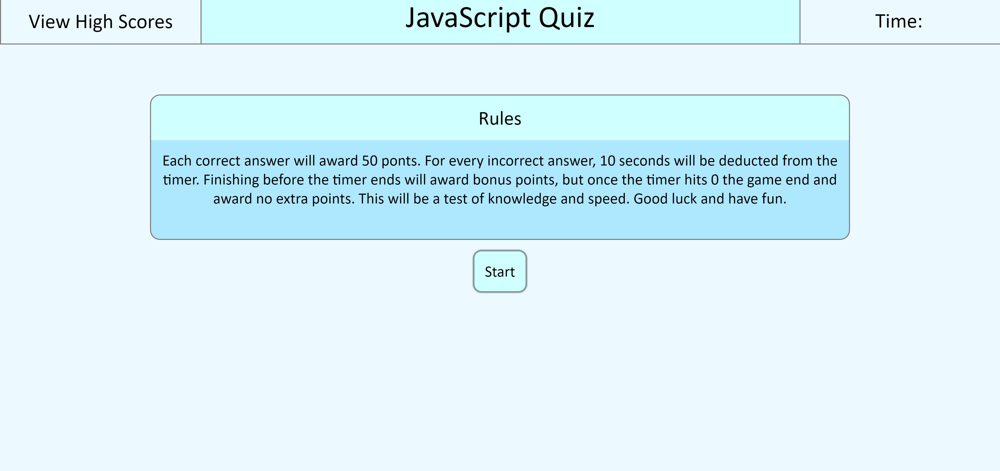

# JavaScript Quiz

This quiz was a test of our skill with javaScript, manipulation of the DOM, and local storage.
The quiz can save and display a list of your scores in order, contains 10 questions with general basic JavaScript questions mixed with DOM questions.

# Rules
Each correct answer will award 50 ponts. For every incorrect answer, 10 seconds will be deducted from the timer. Finishing before the timer ends will award bonus points, but once the timer hits 0 the game end and award no extra points. This will be a test of knowledge and speed. Good luck and have fun.

https://archiedonaho.github.io/JavaScript-Quiz/

